# IAM Policy Monitor - Lambda Functions

This directory contains the AWS Lambda functions for monitoring and automatically remediating IAM policy violations in real-time using an **event-driven architecture**.

## 🏗️ Architecture Overview

The system uses an **event-driven fan-out architecture** with EventBridge as the central event bus:

### **Core Components**

- **`detector.py`** - Monitors CloudTrail events and publishes violations to EventBridge
- **`remediator.py`** - Automatically remediates policy violations via SQS messages
- **`sns_publisher.py`** - Handles SNS email alerts from EventBridge events
- **`slack_handler.py`** - Processes Slack notifications from EventBridge events
- **`audit_logger.py`** - Logs violations to S3 for compliance and Athena analysis
- **`metrics_publisher.py`** - Publishes CloudWatch metrics from EventBridge events
- **`violation_event.py`** - Event schema and EventBridge publishing utilities
- **`slack_notifier.py`** - Slack notification service with retry logic and configuration

## 📊 Event-Driven Flow Charts

### 🔍 Detector Function Flow (Event Publisher)

The detector processes CloudTrail events and publishes structured violation events to EventBridge:

```mermaid
flowchart TD
    A["🚨 EventBridge Event<br/>(CloudTrail IAM Event)"] --> B{{"📋 Extract Event Detail"}}
    B --> C{{"⚙️ Load S3 Configuration"}}
    C --> D["📜 Load rules.yaml"]
    C --> E["🚫 Load suppress.yaml"]

    D --> F{{"🔍 Check Violations"}}
    E --> F

    F --> G{"🎯 Violation Found?"}
    G -->|No| H["✅ Return Success<br/>(No Action Needed)"]
    G -->|Yes| I{{"🛡️ Check Suppression"}}

    I --> J{"🚫 Suppressed?"}
    J -->|Yes| K["📝 Log Suppressed Violation"]
    J -->|No| L{{"⚡ Publish to EventBridge"}}

    K --> M["📊 Send Success Metrics"]
    L --> N["📤 EventBridge Custom Bus<br/>(IAM Violation Event)"]

    N --> O["🔄 Fan-Out to Handlers"]
    O --> P["📧 SNS Publisher"]
    O --> Q["💬 Slack Handler"]
    O --> R["📊 Metrics Publisher"]
    O --> S["💾 Audit Logger"]
    O --> T["🛠️ Remediator (if enabled)"]

    M --> U["✅ Complete"]
    H --> M
```



### 🌐 EventBridge Fan-Out Architecture

EventBridge routes violation events to specialized handler functions:

```mermaid
flowchart TD
    A["🔍 Detector<br/>(Event Publisher)"] --> B["📤 EventBridge<br/>Custom Bus"]

    B --> C["📧 SNS Publisher<br/>(Email Alerts)"]
    B --> D["💬 Slack Handler<br/>(Slack Notifications)"]
    B --> E["📊 Metrics Publisher<br/>(CloudWatch Metrics)"]
    B --> F["💾 Audit Logger<br/>(S3 Compliance Logs)"]
    B --> G["🛠️ Remediator<br/>(SQS Remediation)"]

    C --> H["📮 SNS Topic"]
    D --> I["💬 Slack Webhook"]
    E --> J["📈 CloudWatch"]
    F --> K["🗄️ S3 Bucket<br/>(Partitioned by Date)"]
    G --> L["📨 SQS Queue"]

    H --> M["📧 Email Recipients"]
    I --> N["💬 Slack Channel"]
    J --> O["📊 CloudWatch Dashboard"]
    K --> P["🔍 Athena Analysis"]
    L --> Q["🛠️ Remediation Actions"]
```



### 🛠️ Remediator Function Flow

The remediator processes SQS messages and performs automatic remediation:

```mermaid
flowchart TD
    A["📨 SQS Event<br/>(Remediation Message)"] --> B{{"📦 Parse SQS Records"}}
    B --> C{{"📋 Extract Violation<br/>& Event Details"}}

    C --> D{{"⚙️ Load Configuration<br/>(remediator-config.json)"}}
    D --> E{{"✅ Validate Action<br/>Against Allowed List"}}

    E --> F{"🚫 Action Allowed?"}
    F -->|No| G["⚠️ Skip - Action Not Allowed<br/>Send Metric"]
    F -->|Yes| H{{"🛡️ Safety Validation"}}

    H --> I{"🔒 Safety Check Passed?"}
    I -->|No| J["⚠️ Skip - Safety Failed<br/>Send Metric"]
    I -->|Yes| K{{"🎭 Check Run Mode"}}

    K --> L{"🧪 Dry Run Mode?"}
    L -->|Yes| M["📝 Log Dry Run Action<br/>(No Real Changes)"]
    L -->|No| N{{"⚡ Perform Remediation"}}

    N --> O{"🔧 Remediation Type?"}
    O -->|detach_policy| P["🔗 Detach Policy<br/>(User/Role)"]
    O -->|delete_policy| Q["🗑️ Delete Managed Policy<br/>(+ All Versions)"]
    O -->|delete_inline_policy| R["📄 Delete Inline Policy<br/>(User/Role)"]
    O -->|quarantine_policy| S["🔒 Quarantine Policy<br/>(Rename + Detach)"]

    P --> T{{"📊 Check Result"}}
    Q --> T
    R --> T
    S --> T
    M --> T

    T --> U{"✅ Success?"}
    U -->|Yes| V["📈 Send Success Metric"]
    U -->|No| W["📉 Send Failure Metric"]

    V --> X["💬 Send Slack Notification<br/>(Remediation Complete)"]
    W --> X
    G --> Y["📤 Send Notification<br/>(SNS)"]
    J --> Y

    X --> Y
    Y --> Z["✅ Return Result"]
```



## 📁 Directory Structure

```plaintext
lambdas/
├── 🔍 detector.py              # Policy violation detector Lambda
├── 🛠️ remediator.py            # Policy remediator Lambda
├── 📧 sns_publisher.py         # SNS email alert handler
├── 💬 slack_handler.py         # Slack notification handler
├── 💾 audit_logger.py          # S3 audit logging handler
├── 📊 metrics_publisher.py     # CloudWatch metrics handler
├── 📤 violation_event.py       # Event schema and EventBridge publisher
├── 💬 slack_notifier.py        # Slack notification service
├── 🧪 test_detector.py         # Detector unit tests
├── 🧪 test_remediator.py       # Remediator unit tests
├── 🧪 test_sns_publisher.py    # SNS publisher tests
├── 🧪 test_slack_handler.py    # Slack handler tests
├── 🧪 test_audit_logger.py     # Audit logger tests
├── 🧪 test_metrics_publisher.py # Metrics publisher tests
├── 🧪 test_violation_event.py  # Violation event tests
├── 🧪 test_slack_notifier.py   # Slack notifier tests
├── ⚙️ conftest.py              # Pytest shared fixtures
├── 🏃 run_tests.py             # Simple test runner
├── 📋 requirements.txt         # Runtime dependencies
├── 🔧 requirements-dev.txt     # Development dependencies
├── 📦 pyproject.toml           # Package configuration
├── 🧪 pytest.ini              # Pytest configuration
├── 🔨 build-lambda-package.sh  # Package builder script
├── 🧪 test-local.sh            # Local testing script
└── 📖 README.md               # This file
```

## 🚀 Quick Start

### **Local Testing** (No AWS Credentials Required)

```bash
cd lambdas

# Test detector with sample dangerous policy event
python detector.py

# Test individual event handlers
python sns_publisher.py
python slack_handler.py
python audit_logger.py
python metrics_publisher.py

# Test remediator with sample remediation message
python remediator.py

# Run all unit tests
python run_tests.py
```

### **With Real AWS Integration**

```bash
# Set AWS credentials
export AWS_PROFILE=your-profile

# Configure for your environment
export RULES_BUCKET=your-rules-bucket
export SNS_TOPIC_ARN=arn:aws:sns:region:account:topic
export EVENTBRIDGE_BUS_NAME=iam-policy-violations
export ENABLE_REMEDIATION=false
export DRY_RUN=true

# Test with real AWS calls
USE_REAL_AWS=true python detector.py
python remediator.py --dry-run
```

## 📋 Configuration

### **Environment Variables** (Set by Terraform)

#### **Detector Function**

| Variable | Description |
|----------|-------------|
| `RULES_BUCKET` | S3 bucket containing configuration files |
| `RULES_KEY` | S3 key for rules.yaml configuration |
| `SUPPRESS_KEY` | S3 key for suppress.yaml configuration |
| `EVENTBRIDGE_BUS_NAME` | Custom EventBridge bus for violations |
| `USE_EVENTBRIDGE` | Enable EventBridge publishing (true/false) |
| `SNS_TOPIC_ARN` | Fallback SNS topic for direct notifications |
| `SQS_QUEUE_URL` | Fallback SQS queue for direct remediation |
| `SLACK_WEBHOOK_PARAMETER` | Parameter Store path for Slack webhook URL |

#### **Event Handler Functions**

| Variable | Function | Description |
|----------|----------|-------------|
| `SNS_TOPIC_ARN` | SNS Publisher | SNS topic for email alerts |
| `SLACK_WEBHOOK_PARAMETER` | Slack Handler | Parameter Store path for Slack webhook URL |
| `RULES_BUCKET` | Slack Handler | S3 bucket for notification configuration |
| `AUDIT_BUCKET` | Audit Logger | S3 bucket for audit logs |
| `METRICS_NAMESPACE` | Metrics Publisher | CloudWatch metrics namespace |

#### **Remediator Function**

| Variable | Description |
|----------|-------------|
| `RULES_BUCKET` | S3 bucket containing remediator configuration |
| `SNS_TOPIC_ARN` | SNS topic for remediation notifications |
| `SLACK_WEBHOOK_PARAMETER` | Parameter Store path for Slack webhook URL |
| `ALLOWED_ACTIONS` | JSON array of allowed remediation actions |
| `DRY_RUN` | Enable dry-run mode (no actual changes) |

### **S3 Configuration Files**

| File | Purpose | Used By |
|------|---------|---------|
| `rules.yaml` | Violation detection rules | Detector |
| `suppress.yaml` | Suppression rules for false positives | Detector |
| `notification-config.yaml` | Slack notification configuration | Slack Handler |
| `remediator-config.json` | Remediation settings and safety controls | Remediator |

## 🔧 Development Workflow

1. **📝 Edit Code** - Modify any of the Lambda functions
2. **🧪 Test Locally** - Run individual functions: `python detector.py`
3. **✅ Run Tests** - Execute `python run_tests.py` or `pytest`
4. **🔍 Check Linting** - Run `ruff check .` and `ruff format .`
5. **🔬 Verify Types** - Run `mypy .`
6. **📦 Build Package** - Run `./build-lambda-package.sh`
7. **🚀 Deploy** - Use Terraform to deploy changes

## 🧪 Testing Strategies

### **1. Unit Tests**

```bash
# Quick tests (uses mocks, no AWS dependencies)
python run_tests.py

# Full test suite with coverage
pip install -e ".[dev]"
pytest --cov=. --cov-report=html

# Test specific components
pytest test_detector.py -v
pytest test_violation_event.py -v
pytest test_slack_notifier.py -v

# View coverage report
open htmlcov/index.html
```

### **2. Integration Testing**

```bash
# Run comprehensive local tests
./test-local.sh

# Test with real AWS (requires credentials)
export USE_REAL_AWS=true
python detector.py --event sample-event.json
python sns_publisher.py --event sample-eventbridge-event.json
python slack_handler.py --event sample-eventbridge-event.json
```

### **3. Event-Driven Testing**

```bash
# Test EventBridge event publishing
python -c "
from violation_event import ViolationEventPublisher
publisher = ViolationEventPublisher()
event = {'rule_name': 'test', 'severity': 'HIGH'}
result = publisher.publish_violation_event(event, {})
print(f'Published: {result}')
"

# Validate event schema
python -c "
from violation_event import ViolationEvent
event = ViolationEvent(rule_name='test', severity='HIGH', event_name='TestEvent')
print(event.to_eventbridge_format())
"
```

### **4. Pre-Deployment Checklist**

- [ ] All unit tests pass: `python run_tests.py`
- [ ] Local testing successful: `python detector.py && python remediator.py`
- [ ] Event handlers work: Test all `*_handler.py` and `*_publisher.py` functions
- [ ] Code quality checks pass: `ruff check . && mypy .`
- [ ] Configuration files valid: Validate all YAML/JSON configs
- [ ] Package builds successfully: `./build-lambda-package.sh`
- [ ] EventBridge integration tested: `python violation_event.py`

## 📦 Deployment

### **Building Lambda Packages**

```bash
# Build Lambda packages
./build-lambda-packages.sh

# Or build individually
cd lambdas
./build-lambda-package.sh
```

### **Terraform Deployment**

```bash
# From project root
terraform plan
terraform apply
```

The Terraform configuration automatically:

- Creates all Lambda functions with proper IAM roles
- Sets up EventBridge custom bus and routing rules
- Configures SQS queues for remediation
- Establishes SNS topics for notifications
- Creates CloudWatch log groups and dashboards

## 🛡️ Security Features

### **Detector Security**

- **Event Validation** - Validates CloudTrail event structure
- **Dangerous Policy Detection** - Identifies overly permissive policies
- **Suppression Bypass** - Critical violations bypass suppression rules
- **EventBridge Publishing** - Secure event publishing to custom bus
- **Audit Logging** - All violations logged to S3 for compliance

### **Event Handler Security**

- **Event Schema Validation** - All handlers validate EventBridge event structure
- **IAM Least Privilege** - Each handler has minimal required permissions
- **Error Handling** - Graceful failure with dead letter queue support
- **Configuration Security** - S3-based configuration with encryption

### **Remediator Security**

- **Action Allowlist** - Only permitted remediation actions are executed
- **Safety Checks** - Prevents remediation of critical roles/users
- **Dry Run Mode** - Test mode prevents actual changes
- **Root User Protection** - Never remediates root user actions
- **Audit Trail** - All remediation actions logged to S3

## 📊 Monitoring & Observability

### **CloudWatch Metrics**

All functions send custom metrics to the `IAMPolicyMonitor` namespace:

#### **Detector Metrics**

- `ViolationCount` - Number of violations detected
- `EventProcessed` - CloudTrail events processed
- `EventBridgePublishSuccess` - Successful EventBridge publishes
- `EventBridgePublishFailure` - Failed EventBridge publishes

#### **Handler Metrics**

- `SNSAlertsPublished` - Email alerts sent
- `SlackNotificationsSent` - Slack notifications sent
- `AuditLogsWritten` - S3 audit logs written
- `MetricsPublished` - CloudWatch metrics published

#### **Remediator Metrics**

- `RemediationSuccess` - Successful remediation actions
- `RemediationFailure` - Failed remediation attempts
- `RemediationSkipped` - Skipped actions (safety/allowlist)
- `DryRunExecutions` - Dry-run mode executions

### **Logging Strategy**

- **CloudWatch Logs** - Structured JSON logs for searchability
- **S3 Audit Logs** - Partitioned by date for Athena analysis
- **EventBridge Events** - Structured violation events for processing
- **Dead Letter Queues** - Failed events captured for analysis

### **Athena Queries**

Query violation patterns using S3 audit logs:

```sql
-- Find most common violations by rule
SELECT rule_name, severity, COUNT(*) as violation_count
FROM violations
WHERE year = '2024' AND month = '01'
GROUP BY rule_name, severity
ORDER BY violation_count DESC;

-- Analyze remediation success rates
SELECT
    remediation_action,
    COUNT(*) as total_attempts,
    SUM(CASE WHEN success = true THEN 1 ELSE 0 END) as successful,
    AVG(CASE WHEN success = true THEN 1.0 ELSE 0.0 END) * 100 as success_rate
FROM remediation_logs
WHERE year = '2024' AND month = '01'
GROUP BY remediation_action;
```

## 🔍 Troubleshooting

### **Common Issues**

| Issue | Solution |
|-------|----------|
| `ImportError: No module named 'detector'` | Ensure you're in the `lambdas/` directory and packages are installed |
| `AWS credentials not found` | Set `AWS_PROFILE` or `AWS_ACCESS_KEY_ID`/`AWS_SECRET_ACCESS_KEY` |
| `EventBridge publish failed` | Check Lambda IAM roles have EventBridge permissions |
| `S3 access denied` | Check Lambda IAM roles have S3 permissions to rules bucket |
| `Function times out` | Increase Lambda timeout in Terraform configuration |
| `Handler not receiving events` | Check EventBridge rules and target configuration |

### **Debug Mode**

```bash
# Enable debug logging for all functions
export DEBUG=true

python detector.py --log-level DEBUG
python sns_publisher.py --log-level DEBUG
python slack_handler.py --log-level DEBUG
python audit_logger.py --log-level DEBUG
python metrics_publisher.py --log-level DEBUG
python remediator.py --log-level DEBUG

# Test with custom events
python detector.py --event custom-event.json --rules custom-rules.yaml
python slack_handler.py --event custom-eventbridge-event.json
```

### **Event-Driven Debugging**

```bash
# Test EventBridge event publishing
python -c "
from violation_event import ViolationEventPublisher
publisher = ViolationEventPublisher()
event = {'rule_name': 'test', 'severity': 'HIGH'}
result = publisher.publish_violation_event(event, {})
print(f'Published: {result}')
"

# Validate event schema
python -c "
from violation_event import ViolationEvent
event = ViolationEvent(rule_name='test', severity='HIGH', event_name='TestEvent')
print(event.to_eventbridge_format())
"
```

### **Validation Commands**

```bash
# Validate YAML configuration
python -c "import yaml; yaml.safe_load(open('../templates/rules.yaml'))"
python -c "import yaml; yaml.safe_load(open('../templates/suppress.yaml'))"
python -c "import yaml; yaml.safe_load(open('../templates/notification-config.yaml'))"

# Validate JSON configuration
python -c "import json; json.load(open('sample-config.json'))"

# Test AWS connectivity
aws sts get-caller-identity
aws events list-rules --event-bus-name iam-policy-violations
```

## 🏗️ Architecture Design Decisions

### **Event-Driven Architecture Benefits**

- **Scalability** - Each handler can scale independently
- **Reliability** - Failed events go to dead letter queues
- **Maintainability** - Clear separation of concerns
- **Extensibility** - Easy to add new handlers without changing core logic
- **Testability** - Each component can be tested in isolation

### **EventBridge vs Direct Integration**

- **EventBridge** - Decoupled, reliable, supports multiple targets
- **Direct Integration** - Fallback mode for simpler deployments
- **Hybrid Approach** - System supports both modes for flexibility

### **Separation of Concerns**

- **Detector** - Focus only on detection and event publishing
- **Handlers** - Each handles one specific notification channel
- **Remediator** - Focus only on safe remediation actions
- **Configuration** - Externalized to S3 for runtime updates

### **Observability First**

- **Structured Events** - All events have consistent schema
- **Custom Metrics** - Business KPIs tracked in CloudWatch
- **Audit Trails** - Complete compliance logging to S3
- **Dead Letter Queues** - Failed events captured for analysis

## 📚 Additional Resources

- [AWS EventBridge Documentation](https://docs.aws.amazon.com/eventbridge/)
- [AWS IAM Best Practices](https://docs.aws.amazon.com/IAM/latest/UserGuide/best-practices.html)
- [CloudTrail Event Structure](https://docs.aws.amazon.com/awscloudtrail/latest/userguide/cloudtrail-event-reference.html)
- [Lambda Function Configuration](https://docs.aws.amazon.com/lambda/latest/dg/configuration-function-common.html)
- [EventBridge Event Patterns](https://docs.aws.amazon.com/eventbridge/latest/userguide/eb-event-patterns.html)
- [Slack Webhook API](https://api.slack.com/messaging/webhooks)
- [CloudWatch Custom Metrics](https://docs.aws.amazon.com/AmazonCloudWatch/latest/monitoring/publishingMetrics.html)
